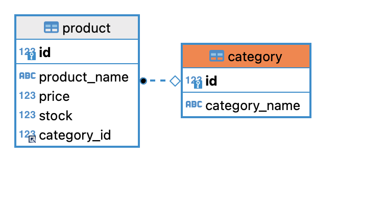
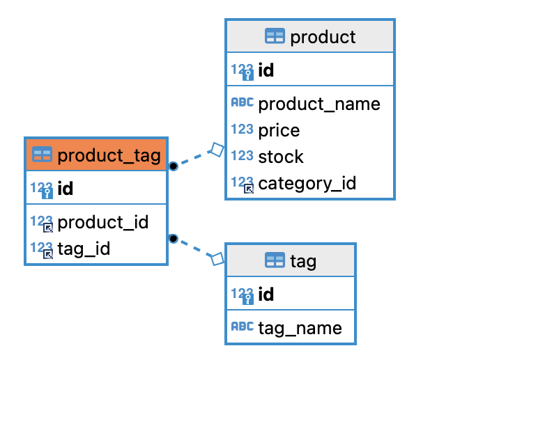
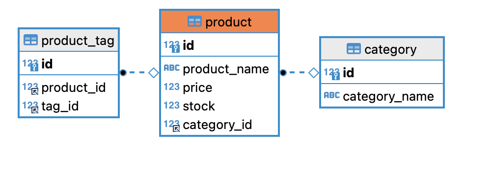
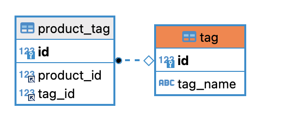
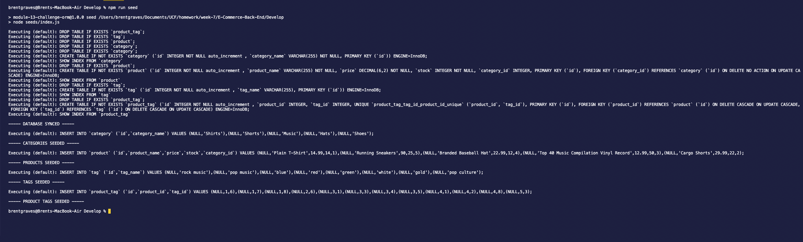
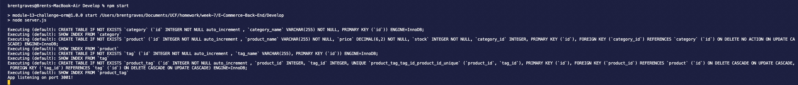

# Ecommerce Backend Application

  

  ## Description

  Building a backend of an e-commerce site by modifying starter code. Utilizing, Express, MySQL, JSON, Sequalize, Insomnia are all used in demonstration.
  
  Click the link below to visit my deployed page.
PLEASE NOTE 2 VIDEOS SECOND DEMONSTRATES FUNCTIONALITY OF DELETE

https://www.youtube.com/watch?v=FHILX8-0Arc

https://youtu.be/cRWWq7Ghyec

  ## Table of Contents
  
  * [Goals](#goals)
  * [Usage](#usage) 
  * [Installation](#installation)  
  * [Test](#test)
  * [Problems](#problems)
  * [Visualization](#visualization)
  * [Acknowledgements](#acknowledgements)
  * [Contributions](#contributions)
  * [Resources](#resources)
  * [License](#license) 
  * [Contact](#contact) 
  
  ## Goals

  To connect a backend to working front end. This required utilizing GET, POST, PUT,  DELETE, Routes to be utilized in insomnia.

  ## Usage

  Connect back end to a front end e-commerce site.

  ## Installation
  
  First, install the dependencies by running "npm i".
  
  Second, open your my sql and enter schema with a live host and create a database to to connect to.

  Third,  "npm run seed" after the .env file is utilized with a proper username and password. A Screenshot below shows successful running of the command.
  
  Fourth, enter npm start. This will activate the local host to be manipulated at localhost:3001.  

  ## Test

  No test are written for this application. However, eventually a npm audit fix may be needed to run in case of vulnerabilities in the dependecies in the package lock JSON due to newer versions being released. But as of this time there are no vulnerabilities. However, this is not a anticipated outcome from the installation process.

  ## Problems

  Getting the productroutes.js file to connect was the most difficult. Otherwise everything fell into place from the miniproject.

  ## Visualization

MOCK UP IMAGES

The Following images show interconnectivity in MySQL

command line screenshot of npm run seed

command line screenshot of npm start

  ## Acknowledgements

  Brent Graves, Fenix Sampson, Gabriel Cavalcante Causin

  ## Contributions

  submit a fork request and feel free to refractor the code

  ## Resources
 
  Eloquent JS, In class activities

  ## License

  Copyright 2021 Brent Graves

  Permission is hereby granted, free of charge, to any person obtaining a copy of this software and associated documentation files (the "Software"), to deal in the Software without restriction, including without limitation the rights to use, copy, modify, merge, publish, distribute, sublicense, and/or sell copies of the Software, and to permit persons to whom the Software is furnished to do so, subject to the following conditions:
  
  The above copyright notice and this permission notice shall be included in all copies or substantial portions of the Software.
  
  THE SOFTWARE IS PROVIDED "AS IS", WITHOUT WARRANTY OF ANY KIND, EXPRESS OR IMPLIED, INCLUDING BUT NOT LIMITED TO THE WARRANTIES OF MERCHANTABILITY, FITNESS FOR A PARTICULAR PURPOSE AND NONINFRINGEMENT. IN NO EVENT SHALL THE AUTHORS OR COPYRIGHT HOLDERS BE LIABLE FOR ANY CLAIM, DAMAGES OR OTHER LIABILITY, WHETHER IN AN ACTION OF CONTRACT, TORT OR OTHERWISE, ARISING FROM, OUT OF OR IN CONNECTION WITH THE SOFTWARE OR THE USE OR OTHER DEALINGS IN THE SOFTWARE.

  ## Contact
  
  GitHub Username: grave019 
 
  Link to Github account[grave019](https://github.com/grave019)

  Email: brent.r.graves82@gmail.com
